# Ecommerce Backend with Enhanced Endpoints

This project involves the development of an ecommerce backend with enhanced endpoints, utilizing MongoDB as the primary persistence system. The goal is to create well-defined endpoints for managing products and shopping carts.

## Task Requirements

The main objectives of this task are:
- Utilize MongoDB as the primary persistence system.
- Define comprehensive endpoints for product and cart management.

### Product Endpoint Enhancements

- **GET /products**
  - Allows optional query parameters: `limit`, `page`, `sort`, and `query`.
  - Professionalizes product queries with filters, pagination, and sorting.

### Cart Endpoint Enhancements

- **DELETE /api/carts/:cid/products/:pid**
  - Removes a specific product from the cart.
  
- **PUT /api/carts/:cid**
  - Updates the cart with an array of products.
  
- **PUT /api/carts/:cid/products/:pid**
  - Updates the quantity of a product in the cart.
  
- **DELETE /api/carts/:cid**
  - Clears all products from the cart.


## Code Structure and Explanation

### Routes

- **`cartsRoutes.js`**: This file contains the routes related to carts. It defines endpoints for managing carts, including creating new carts, updating cart contents, and deleting items from a cart.

- **`productsRoutes.js`**: This file defines the routes related to products. It includes endpoints for retrieving products, paginating through products, and sorting products.

### Models

- **`cart.model.js`**: The Cart model defines the structure of a cart in the database. It includes fields such as `userId` (for the user associated with the cart) and `products` (an array containing product details and quantities).

- **`product.model.js`**: The Product model defines the structure of a product in the database. It includes fields such as `name`, `price`, `category`, and `availability`.

### Connecting to `app.js`

In `app.js`, we set up the Express application and connect the defined routes to specific paths:

- We import the defined routes using `require`, like so:
  ```javascript
  const cartsRoutes = require('./routes/cartsRoutes');
  const productsRoutes = require('./routes/productsRoutes');

### We then use app.use to specify the base paths for these routes:

- **app.use('/api/carts', cartsRoutes);**
- **app.use('/api/products', productsRoutes);**


## Usage

1. Install the required dependencies:
   ```bash
   npm install

### Run the server:

npm start

## Additional Information

To gain a deeper understanding of this project and view practical examples, you can refer to the following resources:

- **Postman Collection:** Explore the provided Postman collection to interact with the API endpoints and see how they function. The collection includes detailed requests and responses.

- **Screenshots:** View screenshots that illustrate the usage of various endpoints in the Postman collection. These images provide a visual guide to working with the API.

##  Products Endpoints
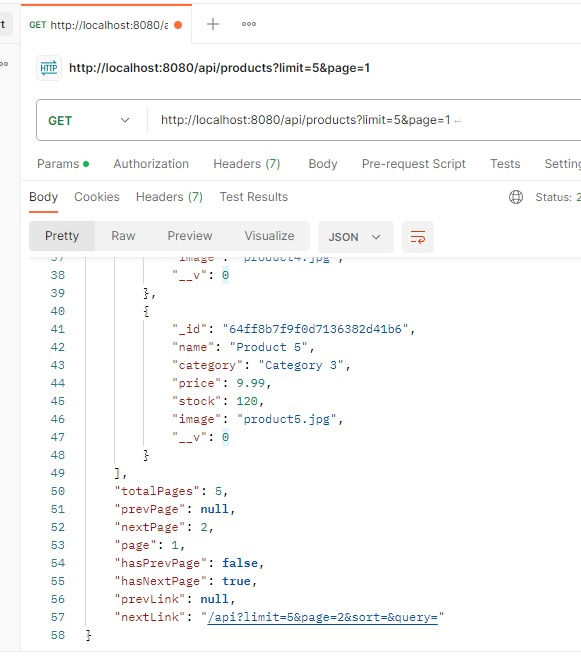
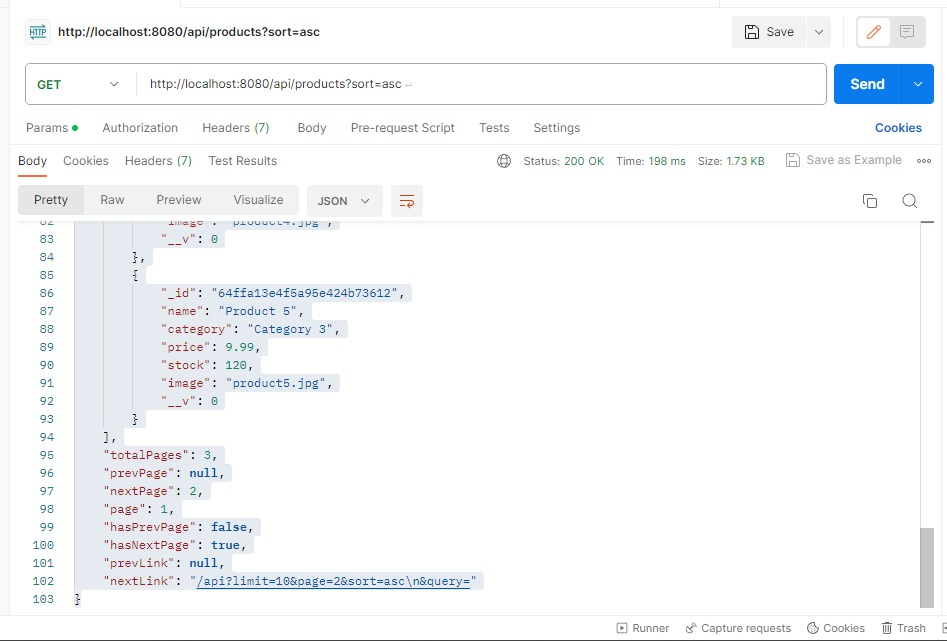
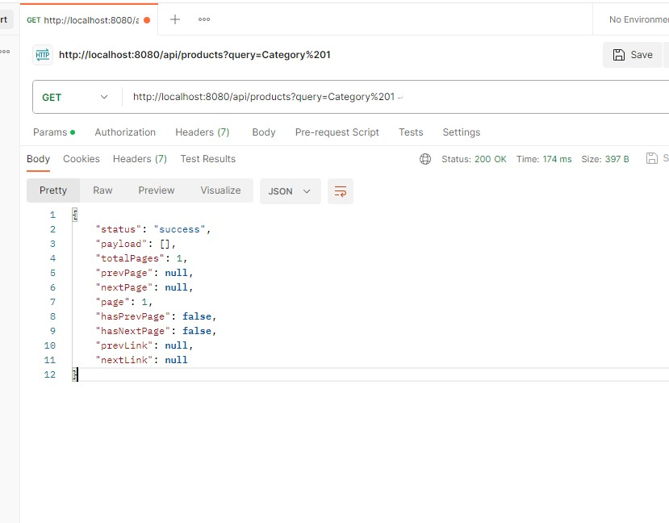
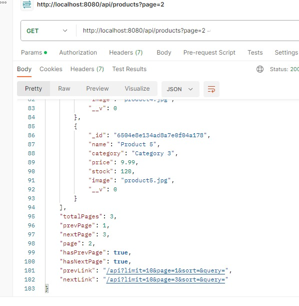


##  Carts Enpoints
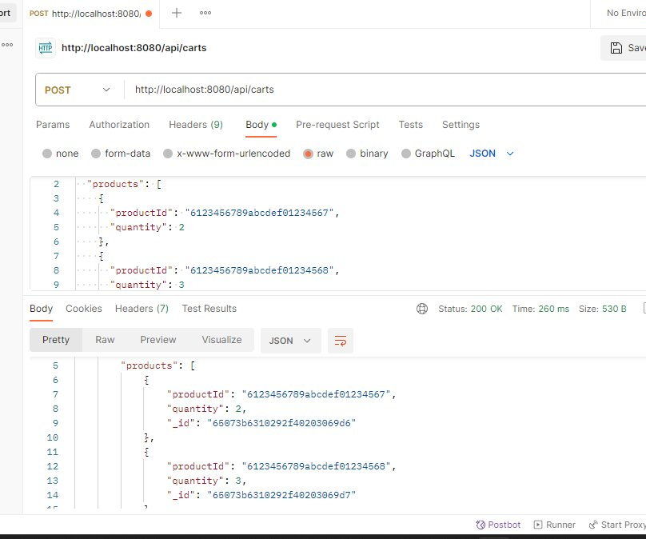

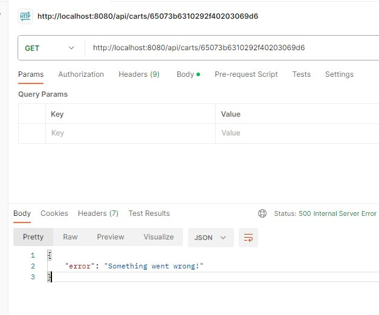
If you encounter the response {"error": "Something went wrong!"} during a GET request, it typically indicates an unspecified error in the server's processing. The server attempted to fulfill the request, but encountered an unforeseen issue that prevented it from providing the expected response. The error message, unfortunately, lacks specific details about the nature of the problem, necessitating further investigation within the server's codebase to identify and rectify the underlying issue.

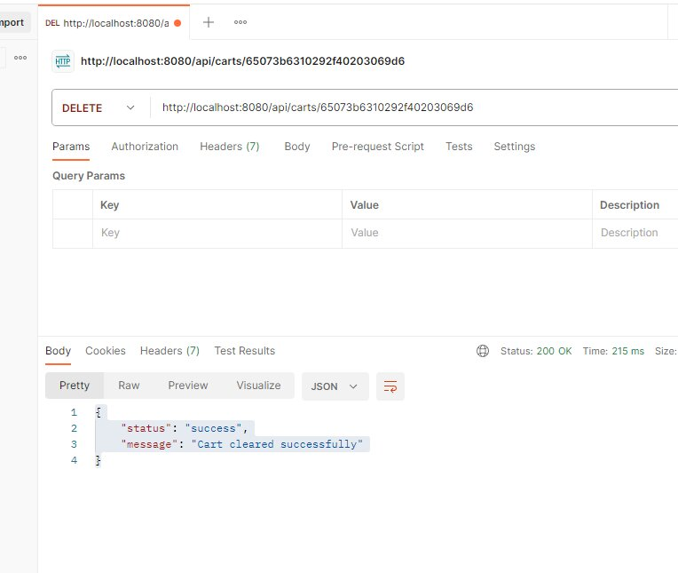

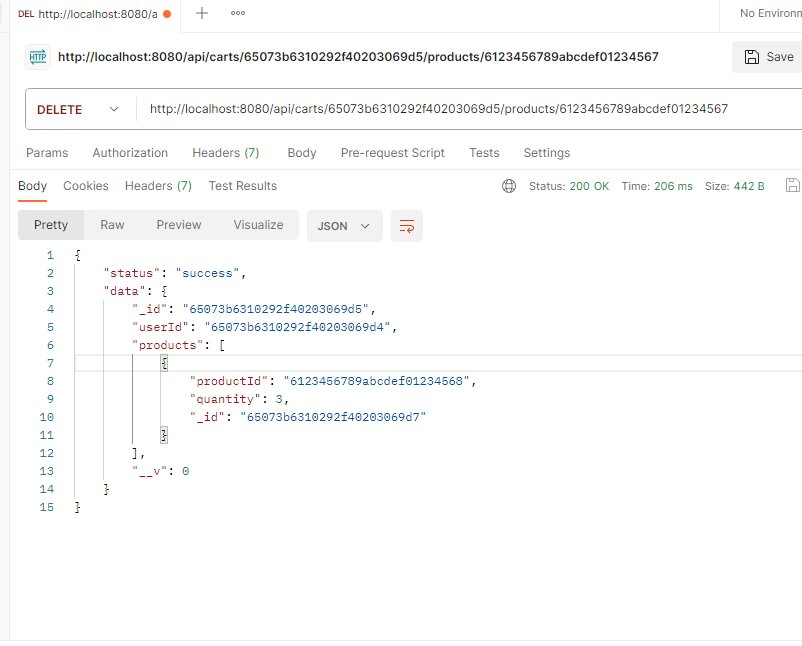

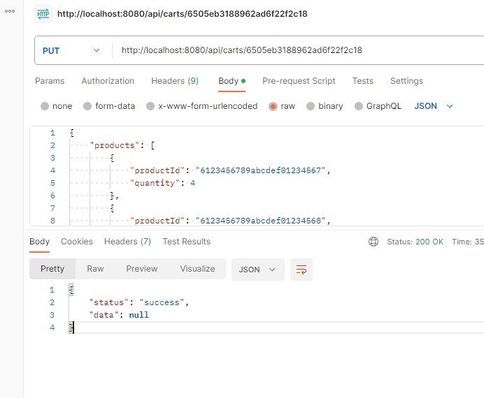

Status: "success": The request was successful in terms of reaching the server and being processed.

Data: null: In a typical PUT request to update a resource, the server would often respond with the updated data. However, in this case, the server did not return any updated data. The data field is null, indicating there was no specific data returned as part of the response.

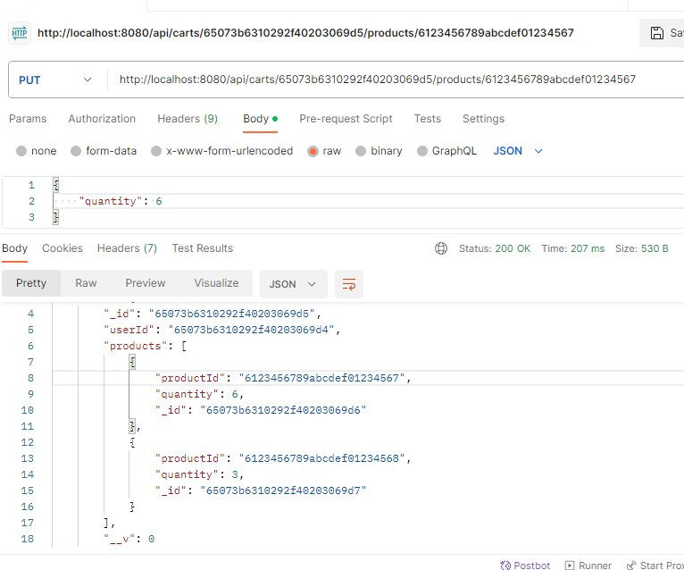


- **MongoDB Atlas Collections:** Watch an informative GIF showcasing the interaction between the backend and MongoDB Atlas. This dynamic visualization demonstrates how data is stored and retrieved from the database.

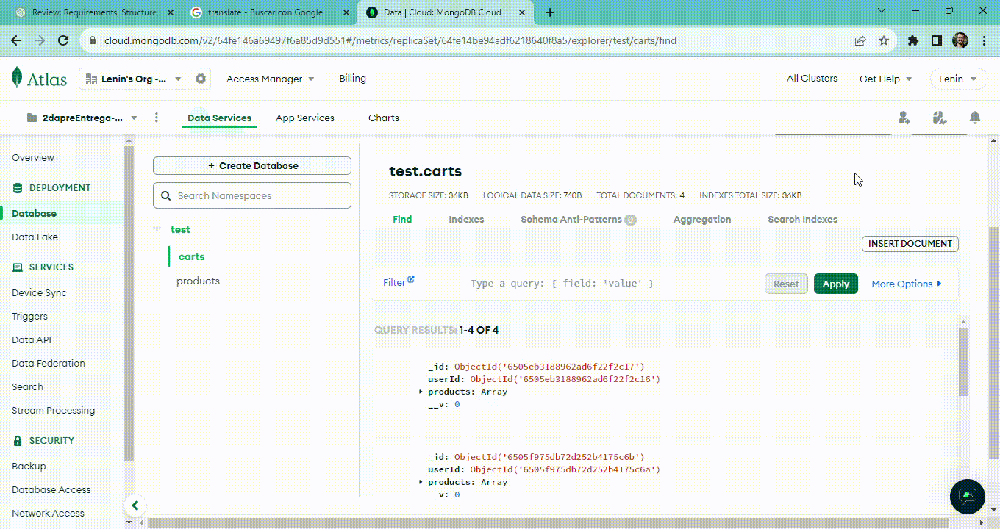

## Conclusion

This project represents a comprehensive implementation of an e-commerce backend, leveraging Node.js, Express, and MongoDB. The primary objectives were to enhance database persistence, create essential endpoints for managing products and carts, and optimize queries with features like filtering, pagination, and sorting.

- **Database and Models**: MongoDB was adopted as the main persistence system. The project includes well-defined models such as `Cart` and `Product` to structure the data.

- **Endpoints and Functionality**: Various endpoints were created to handle operations related to products and carts. These endpoints allow for product retrieval, cart management, and updating quantities of products in a cart.

- **Code Structure**: The codebase is structured into models and routes, promoting modularity and maintainability. The routes are connected to the main `app.js` file to manage incoming requests.

## Contact

For further inquiries or assistance, please reach out to:

- [Lenin Acosta](mailto:leninacosta21@gmail.com)

- [2dapreEntrepf](https://github.com/Leninead/2dapreEntrepf.git)

- [LinkedIn Profile](https://www.linkedin.com/in/lenin-acosta-b32b8a262/)


